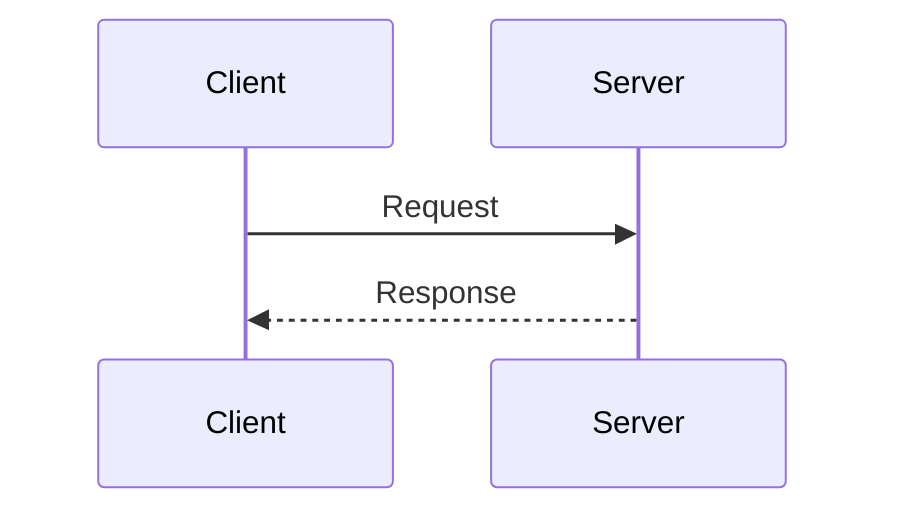

# Auth-Agent Documentation

This directory contains the complete documentation for Auth-Agent, powered by [Mintlify](https://mintlify.com).

## 🚀 Quick Start

### Prerequisites

- Node.js 16+ installed
- npm or yarn package manager

### Installation

```bash
# Install Mintlify CLI globally
npm install -g mintlify

# Or using the script
npm run install:mintlify
```

### Development

```bash
# Start the documentation server
npm run dev

# Or directly with Mintlify
mintlify dev
```

The documentation will be available at `http://localhost:3000`

### Preview on Different Port

```bash
npm run preview
```

Runs on port 3001 to avoid conflicts.

## 📁 Structure

```
docs/
├── mint.json                 # Mintlify configuration
├── package.json             # npm scripts
├── introduction.mdx         # Home page
├── quickstart.mdx           # Quick start guide
├── installation.mdx         # Installation instructions
├── authentication-flow.mdx  # OAuth flow explanation
│
├── concepts/               # Core concepts
│   ├── oauth.mdx
│   ├── pkce.mdx
│   ├── tokens.mdx
│   └── security.mdx
│
├── sdk/                    # SDK documentation
│   ├── react/
│   │   ├── getting-started.mdx
│   │   ├── auth-provider.mdx
│   │   ├── hooks.mdx
│   │   └── components.mdx
│   ├── javascript/
│   └── python/
│
├── api-reference/          # API documentation
│   ├── overview.mdx
│   ├── oauth/
│   │   ├── authorize.mdx
│   │   ├── token.mdx
│   │   └── userinfo.mdx
│   └── agents/
│       ├── register.mdx
│       └── profile.mdx
│
├── components/             # Component docs
├── examples/               # Example implementations
├── guides/                 # How-to guides
└── advanced/              # Advanced topics
```

## 🎨 Customization

### Branding

Edit `mint.json` to customize:

- **Colors**: Primary, light, dark colors
- **Logo**: Light and dark mode logos
- **Navigation**: Sidebar structure
- **Tabs**: Top-level navigation tabs

### Adding Pages

1. Create a new `.mdx` file in the appropriate directory
2. Add frontmatter:
   ```yaml
   ---
   title: 'Page Title'
   description: 'Page description'
   ---
   ```
3. Add the file path to `navigation` in `mint.json`

### Components

Mintlify provides built-in components:

- `<Card>` - Feature cards
- `<CardGroup>` - Card grid layouts
- `<Accordion>` - Collapsible sections
- `<Tabs>` - Tabbed content
- `<CodeGroup>` - Multiple code examples
- `<ParamField>` - API parameters
- `<ResponseField>` - API responses
- `<Warning>`, `<Note>`, `<Info>` - Callouts

## 📝 Writing Documentation

### Code Blocks

Use triple backticks with language specification:

````markdown
```javascript
const client = new AuthAgentClient({
  clientId: 'your_id',
});
```
````

### API Endpoints

Use the `api` frontmatter field:

```yaml
---
title: 'Get User Info'
api: 'GET /oauth2/userinfo'
---
```

### Mermaid Diagrams

```markdown

```

## 🚢 Deployment

### Mintlify Hosting (Recommended)

1. Push your `docs/` directory to GitHub
2. Connect to Mintlify at [mintlify.com](https://mintlify.com)
3. Mintlify will automatically deploy on every push

### Self-Hosting

```bash
# Build static site
mintlify build

# Output in .mintlify/ directory
# Serve with any static hosting (Netlify, Vercel, etc.)
```

### Custom Domain

Configure in Mintlify dashboard or add `CNAME` file.

## 📚 Resources

- [Mintlify Documentation](https://mintlify.com/docs)
- [MDX Documentation](https://mdxjs.com/)
- [Auth-Agent Repository](https://github.com/auth-agent/auth-agent)

## 🤝 Contributing

1. Create a new branch for your changes
2. Make your edits to `.mdx` files
3. Test locally with `mintlify dev`
4. Submit a pull request

## 📄 License

MIT © Auth-Agent

---

**Need help?** Open an issue or contact support@auth-agent.com

