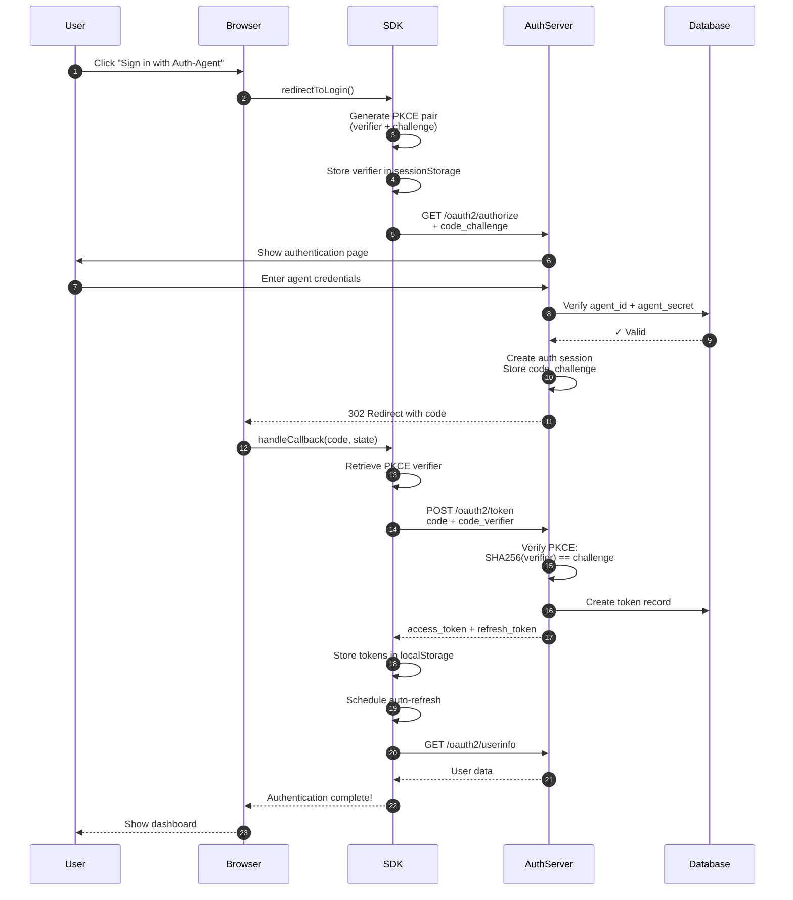
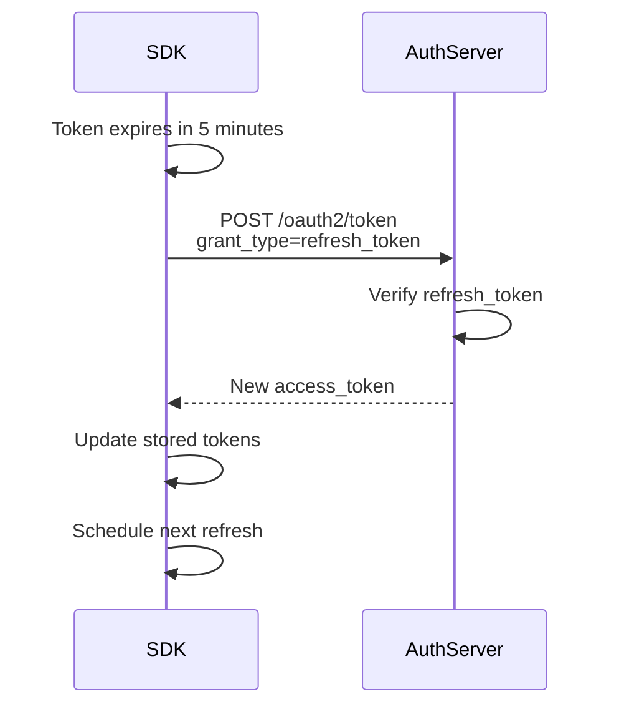

## Complete OAuth 2.1 Flow

Auth-Agent implements the OAuth 2.1 Authorization Code Flow with PKCE (Proof Key for Code Exchange). Here's how it works:



## Step-by-Step Breakdown

<Steps>
  <Step title="1. Generate Login URL">
    When user clicks sign-in, the SDK generates a PKCE code verifier and challenge:

    ```typescript
    // Generate random 32-byte verifier
    const codeVerifier = base64url(crypto.randomBytes(32));

    // Create SHA-256 challenge
    const codeChallenge = base64url(sha256(codeVerifier));

    // Store verifier for later
    sessionStorage.setItem('code_verifier', codeVerifier);
    ```

    Then constructs the authorization URL with the challenge.

  </Step>

  <Step title="2. Redirect to Auth Server">
    Browser redirects to:
    
    ```
    GET /oauth2/authorize?
      client_id=your_agent_id&
      redirect_uri=http://localhost:3000/callback&
      response_type=code&
      scope=openid+profile+email&
      code_challenge=<base64url_challenge>&
      code_challenge_method=S256&
      state=<random_csrf_token>
    ```

    <Info>
      The `state` parameter protects against CSRF attacks.
    </Info>

  </Step>

  <Step title="3. User Authenticates">
    The Auth-Agent server displays an authentication page where the user enters:
    
    - **Agent ID**: Their registered agent identifier
    - **Agent Secret**: Their secure password
    - **Model Name**: The AI model being used

    The server verifies these credentials against the database.

  </Step>

  <Step title="4. Generate Authorization Code">
    If authentication succeeds:
    
    - Server creates an auth session
    - Stores the PKCE `code_challenge`
    - Generates a one-time `authorization_code`
    - Redirects back to your app

    ```
    HTTP/1.1 302 Found
    Location: http://localhost:3000/callback?
      code=AUTH_CODE_HERE&
      state=<same_state>
    ```

  </Step>

  <Step title="5. Exchange Code for Tokens">
    Your app's callback handler receives the code and exchanges it for tokens:

    ```
    POST /oauth2/token
    Content-Type: application/x-www-form-urlencoded

    grant_type=authorization_code&
    code=AUTH_CODE_HERE&
    client_id=your_agent_id&
    redirect_uri=http://localhost:3000/callback&
    code_verifier=<original_verifier>
    ```

    <Warning>
      The authorization code can only be used once and expires in 10 minutes.
    </Warning>

  </Step>

  <Step title="6. Verify PKCE">
    Server verifies the PKCE proof:

    ```typescript
    // Server computes challenge from verifier
    const computed = base64url(sha256(code_verifier));

    // Compare with stored challenge
    if (computed === stored_code_challenge) {
      // ✓ PKCE verified!
      // Issue tokens
    }
    ```

    This proves the same client that started the flow is completing it.

  </Step>

  <Step title="7. Issue Tokens">
    Server responds with tokens:

    ```json
    {
      "access_token": "eyJhbGci...",
      "token_type": "Bearer",
      "expires_in": 3600,
      "refresh_token": "eyJhbGci...",
      "scope": "openid profile email"
    }
    ```

    <ParamField path="access_token" type="string">
      JWT token for accessing protected resources (expires in 1 hour)
    </ParamField>

    <ParamField path="refresh_token" type="string">
      Long-lived token for refreshing access tokens (expires in 30 days)
    </ParamField>

  </Step>

  <Step title="8. Store Tokens">
    SDK stores tokens securely:

    ```typescript
    // Calculate expiration time
    const expiresAt = Date.now() + (expires_in * 1000);

    // Store in localStorage (or sessionStorage/memory)
    localStorage.setItem('auth_agent_tokens', JSON.stringify({
      access_token,
      refresh_token,
      expires_at: expiresAt,
      scope,
    }));
    ```

  </Step>

  <Step title="9. Fetch User Info">
    SDK makes an authenticated request to get user details:

    ```
    GET /oauth2/userinfo
    Authorization: Bearer <access_token>
    ```

    Response:
    ```json
    {
      "sub": "agent_id",
      "agent_id": "my_agent_123",
      "name": "John Doe",
      "email": "john@example.com",
      "model_name": "gpt-4",
      "permissions": ["read", "write"]
    }
    ```

  </Step>

  <Step title="10. Schedule Auto-Refresh">
    SDK schedules automatic token refresh 5 minutes before expiration:

    ```typescript
    const timeUntilRefresh = expiresAt - Date.now() - (5 * 60 * 1000);

    setTimeout(async () => {
      await client.refreshToken();
    }, timeUntilRefresh);
    ```

  </Step>
</Steps>

## Token Refresh Flow

When the access token is about to expire:



### Refresh Request

```
POST /oauth2/token
Content-Type: application/x-www-form-urlencoded

grant_type=refresh_token&
refresh_token=<refresh_token>&
client_id=your_agent_id
```

### Refresh Response

```json
{
  "access_token": "new_eyJhbGci...",
  "token_type": "Bearer",
  "expires_in": 3600,
  "scope": "openid profile email"
}
```

<Note>
  Refresh tokens are NOT rotated by default. The same refresh token can be used
  multiple times until it expires.
</Note>

## Security Features

<AccordionGroup>
  <Accordion title="PKCE (Proof Key for Code Exchange)" icon="shield-check">
    PKCE prevents authorization code interception attacks:
    
    - Attacker cannot use a stolen code without the verifier
    - Even if code is intercepted, it's useless without the PKCE verifier
    - Verifier never leaves the client, only challenge is sent
    
    **Required by OAuth 2.1 for all clients.**
  </Accordion>

{" "}
<Accordion title="State Parameter" icon="random">
  Protects against CSRF (Cross-Site Request Forgery) attacks: - Random state
  generated for each request - Stored in sessionStorage - Verified when handling
  callback - Prevents attackers from initiating unauthorized auth flows
</Accordion>

{" "}
<Accordion title="Secure Token Storage" icon="lock">
  Tokens are stored securely: - `localStorage`: Persistent across browser
  sessions - `sessionStorage`: Cleared when tab/browser closes - `memory`: Only
  in JavaScript memory (most secure but not persistent) **Note:** Even with
  localStorage, tokens are HttpOnly-equivalent because they're only accessible
  to your origin.
</Accordion>

{" "}
<Accordion title="Token Expiration" icon="clock">
  Tokens have limited lifetimes: - Access tokens: 1 hour - Refresh tokens: 30
  days - Authorization codes: 10 minutes - Auth sessions: 10 minutes (for
  challenge completion) Automatic refresh keeps users logged in without
  re-authentication.
</Accordion>

  <Accordion title="Redirect URI Validation" icon="link">
    Prevents open redirect vulnerabilities:
    
    - Redirect URI must exactly match registered URI
    - Protocol, domain, port, and path must all match
    - No wildcard or pattern matching
  </Accordion>
</AccordionGroup>

## Error Scenarios

<Tabs>
  <Tab title="Invalid Credentials">
    ```json
    {
      "error": "invalid_credentials",
      "error_description": "Invalid agent credentials"
    }
    ```
    
    **Cause:** Wrong agent_id or agent_secret
    
    **Solution:** Verify credentials or register new agent
  </Tab>

  <Tab title="PKCE Verification Failed">
    ```json
    {
      "error": "invalid_grant",
      "error_description": "PKCE verification failed"
    }
    ```
    
    **Cause:** Code verifier doesn't match challenge
    
    **Solution:** Clear sessionStorage and retry. Ensure cookies enabled.
  </Tab>

  <Tab title="Expired Code">
    ```json
    {
      "error": "invalid_grant",
      "error_description": "Authorization code has expired"
    }
    ```
    
    **Cause:** Authorization code older than 10 minutes
    
    **Solution:** Restart the auth flow
  </Tab>

  <Tab title="Redirect URI Mismatch">
    ```json
    {
      "error": "invalid_grant",
      "error_description": "redirect_uri does not match"
    }
    ```
    
    **Cause:** Redirect URI doesn't exactly match registered URI
    
    **Solution:** Verify URI including protocol, port, and path
  </Tab>
</Tabs>

## Next Steps

<CardGroup cols={2}>
  <Card title="OAuth 2.1 Concepts" icon="book" href="/concepts/oauth">
    Deep dive into OAuth 2.1 specification
  </Card>
  <Card title="PKCE Explained" icon="key" href="/concepts/pkce">
    Understanding PKCE in detail
  </Card>
  <Card title="Token Management" icon="coins" href="/concepts/tokens">
    How tokens are managed and refreshed
  </Card>
  <Card title="Security Best Practices" icon="shield" href="/concepts/security">
    Security recommendations
  </Card>
</CardGroup>
