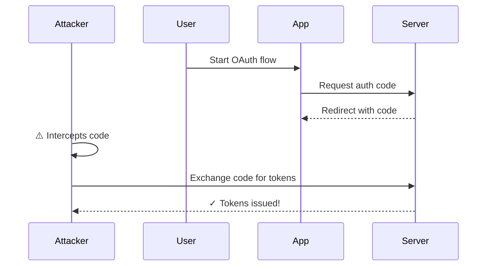
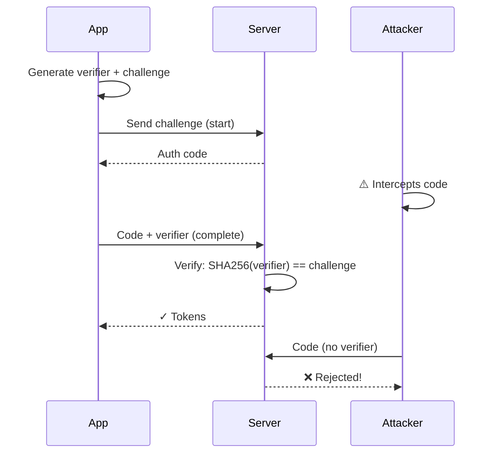

## What is PKCE?

PKCE (pronounced "pixie") is a security extension to OAuth 2.0 that prevents authorization code interception attacks. It's **mandatory in OAuth 2.1**.

## The Problem

Without PKCE, an attacker who intercepts an authorization code can exchange it for tokens:



## The Solution

PKCE adds cryptographic proof that the same client completing the flow started it:



## How It Works

<Steps>
  <Step title="Generate Code Verifier">
    Client generates a random 32-byte string:

    ```typescript
    const verifier = base64url(crypto.randomBytes(32));
    // Example: "dBjftJeZ4CVP-mB92K27uhbUJU1p1r_wW1gFWFOEjXk"
    ```

  </Step>

  <Step title="Create Code Challenge">
    Hash the verifier with SHA-256:

    ```typescript
    const challenge = base64url(sha256(verifier));
    // Example: "E9Melhoa2OwvFrEMTJguCHaoeK1t8URWbuGJSstw-cM"
    ```

  </Step>

  <Step title="Send Challenge">
    Include challenge in authorization request:

    ```
    /oauth2/authorize?
      code_challenge=E9Melhoa2OwvFrEMTJguCHaoeK1t8URWbuGJSstw-cM&
      code_challenge_method=S256
    ```

  </Step>

{" "}
<Step title="Store Verifier">
  Client stores verifier securely (e.g., sessionStorage)
</Step>

  <Step title="Send Verifier">
    Include verifier when exchanging code:

    ```
    POST /oauth2/token
    code_verifier=dBjftJeZ4CVP-mB92K27uhbUJU1p1r_wW1gFWFOEjXk
    ```

  </Step>

  <Step title="Server Verifies">
    Server computes challenge from verifier and compares:

    ```typescript
    const computed = base64url(sha256(received_verifier));
    if (computed === stored_challenge) {
      // ✓ PKCE verified!
    }
    ```

  </Step>
</Steps>

## Implementation

### Using Auth-Agent SDK

The SDK handles PKCE automatically:

```typescript
import { AuthAgentClient } from "ai-auth";

const client = new AuthAgentClient({
  clientId: "your_agent_id",
  redirectUri: "http://localhost:3000/callback",
});

// PKCE is generated and verified automatically
await client.redirectToLogin();
```

### Manual Implementation

```typescript
// 1. Generate verifier
const verifier = base64url(crypto.getRandomValues(new Uint8Array(32)));

// 2. Create challenge
const encoder = new TextEncoder();
const data = encoder.encode(verifier);
const hash = await crypto.subtle.digest("SHA-256", data);
const challenge = base64url(new Uint8Array(hash));

// 3. Store verifier
sessionStorage.setItem("pkce_verifier", verifier);

// 4. Build auth URL
const authUrl =
  `https://api.auth-agent.com/oauth2/authorize?` +
  `client_id=your_id&` +
  `redirect_uri=http://localhost:3000/callback&` +
  `response_type=code&` +
  `code_challenge=${challenge}&` +
  `code_challenge_method=S256`;

// 5. Later, when exchanging code:
const storedVerifier = sessionStorage.getItem("pkce_verifier");
// Send storedVerifier with token request
```

## Security Benefits

<AccordionGroup>
  <Accordion title="Prevents Code Interception" icon="shield-check">
    Even if an attacker intercepts the authorization code, they cannot use it without the verifier.
  </Accordion>

{" "}
<Accordion title="No Shared Secrets" icon="key">
  Unlike client secrets, the verifier is never shared or registered in advance.
</Accordion>

{" "}
<Accordion title="Works Everywhere" icon="globe">
  Effective in browsers, mobile apps, and SPAs where secrets can't be kept.
</Accordion>

  <Accordion title="Required by Spec" icon="file-contract">
    OAuth 2.1 makes PKCE mandatory for all authorization code flows.
  </Accordion>
</AccordionGroup>

## Common Issues

<Warning>
  **Verifier Not Found:** Make sure you're storing the verifier before
  redirecting and retrieving it correctly after callback.
</Warning>

<Warning>
  **PKCE Verification Failed:** The verifier must be the exact same value that
  generated the challenge. Check for encoding issues.
</Warning>

## References

- [RFC 7636 - PKCE Specification](https://tools.ietf.org/html/rfc7636)
- [OAuth 2.1 Draft](https://oauth.net/2.1/)

## Next Steps

<CardGroup>
  <Card title="Token Management" icon="coins" href="/concepts/tokens">
    Learn about token lifecycle
  </Card>
  <Card title="Security Best Practices" icon="shield" href="/concepts/security">
    Security recommendations
  </Card>
</CardGroup>
