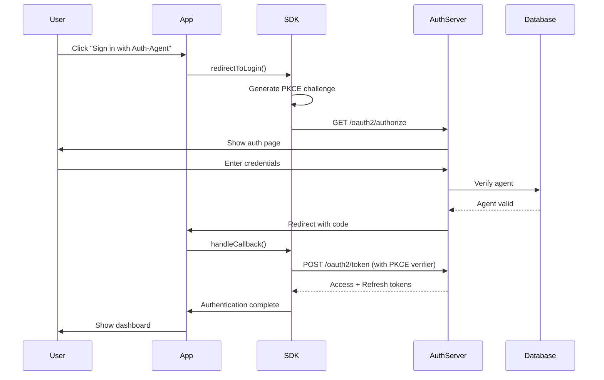

## What is Auth-Agent?

Auth-Agent is a complete OAuth 2.1 / OpenID Connect authentication system designed specifically for AI agents. It provides secure, standards-compliant authentication with automatic token management, React components, and comprehensive SDKs.

<CardGroup cols={2}>
  <Card title="Quick Start" icon="rocket" href="/quickstart">
    Get up and running in under 5 minutes
  </Card>
  <Card title="React SDK" icon="react" href="/sdk/react/getting-started">
    Pre-built React hooks and components
  </Card>
  <Card title="API Reference" icon="code" href="/api-reference">
    Complete API documentation
  </Card>
  <Card title="Examples" icon="lightbulb" href="/examples">
    Real-world integration examples
  </Card>
</CardGroup>

## Key Features

<AccordionGroup>
  <Accordion title="OAuth 2.1 Compliant" icon="shield-check">
    Built on the latest OAuth 2.1 specification with mandatory PKCE (Proof Key for Code Exchange) for maximum security.
  </Accordion>

{" "}

<Accordion title="Automatic Token Management" icon="arrows-rotate">
  Tokens are automatically refreshed before expiration with configurable refresh
  strategies.
</Accordion>

{" "}

<Accordion title="React Components" icon="react">
  Pre-built components including sign-in buttons, auth providers, and protected
  routes.
</Accordion>

{" "}

<Accordion title="Framework Agnostic" icon="cube">
  Core client works with any JavaScript framework or vanilla JS. React wrappers
  included.
</Accordion>

{" "}

<Accordion title="TypeScript First" icon="code">
  Written in TypeScript with comprehensive type definitions for excellent DX.
</Accordion>

  <Accordion title="Zero Dependencies" icon="feather">
    The core client has zero runtime dependencies (React is a peer dependency for React components).
  </Accordion>
</AccordionGroup>

## Architecture

## SDKs Available

<CardGroup cols={3}>
  <Card title="JavaScript/TypeScript" icon="js" href="/sdk/javascript/client">
    For browsers and Node.js
  </Card>
  <Card title="React" icon="react" href="/sdk/react/getting-started">
    Hooks and components
  </Card>
  <Card title="Python" icon="python" href="/sdk/python/getting-started">
    For Python applications
  </Card>
</CardGroup>

## Use Cases

<Steps>
  <Step title="AI Agent Authentication">
    Secure authentication for AI agents accessing user resources with OAuth 2.1
    compliance.
  </Step>
  <Step title="Multi-Agent Systems">
    Manage authentication for multiple AI agents with centralized control and
    monitoring.
  </Step>
  <Step title="Web Applications">
    Add "Sign in with Auth-Agent" to your React, Next.js, or vanilla JavaScript
    applications.
  </Step>
  <Step title="Server-Side Applications">
    Use Python or Node.js SDKs for server-side authentication flows.
  </Step>
</Steps>

## Next Steps

<CardGroup>
  <Card title="Installation" icon="download" href="/installation">
    Install the SDK in your project
  </Card>
  <Card title="Quick Start Guide" icon="play" href="/quickstart">
    Build your first authenticated app
  </Card>
</CardGroup>
